# 1. 对象与类

## 1.1 面向对象程序设计(Object Oriented Programming)

```plantuml
@startuml
Title 面向过程与面向对象的程序设计对比
allowmixing
skinparam rectangle {
	roundCorner 25
}

rectangle OP {
  rectangle "全局数据" as data
  card 过程1
  card 过程2
  card 过程3

  过程1 --> data
  过程2 --> data
  过程3 --> data
}

rectangle OO {
  object "对象1" as o1 {
    对象数据
  }
  object "对象2" as o2 {
    对象数据
  }
  object "对象3" as o3 {
    对象数据
  }

  card 方法1
  card 方法2
  card 方法3

  方法1 --> o1
  方法2 --> o2
  方法3 --> o3
}
@enduml

@startuml
Title Person类图

Person <|-- Employee
Employee <|-- Manager
Person <|-- Student

abstract class Person {
  - private String name
  + Person(String name)
  + public String getDescription()
  + public String toString()
  + public boolean equals(Object otherObject)
  + public int hashCode()
  + public String toString()
}

class Employee {
  - private static int nextId = 1
  - private double salary
  - private LocalDate hireDay
  - private int id

  + public Employee(String name, double salary, int year, int month, int day)
  + public Employee(String name, double salary)
  + public double getSalary()
  + public LocalDate getHiraDay()
  + public int getId()
  + public void setId()
  + public double raiseSalary(double byPercent)
  + public static int getNextId()
  + public String getDescription()
  + public boolean equals(Object otherObject)
  + public int hashCode()
  + public String toString()
}

class Student {
  - private String major

  + public Student(String name, String major)
  + public String getMajor()
  + public String getDescription()
}

class Manager {
  - private double bonus

  + public Manager(String name, double salary, int year, int month, int day)
  + public double getSalary()
  + public void setBonus(double bonus)
  + public boolean equals(Object otherObject)
  + public int hashCode()
  + public String toString()    
}
@enduml
```

### 1.1.1 类

- 类（class）
- 构造（condtruct）
- 实例（instance）
- 封装（encapsulation)
- 实例域（instance filed）
- 方法（method）
- 状态（state）
- 继承（inheritance）

### 1.1.2 对象

- 对象的行为（behavior）
- 对象的状态（state）
- 对象标识（identity）

### 1.1.3 类之间的关系

- 依赖（“use-a”）
- 聚合（“has-a”）
- 继承（“is-a”)

## 1.2 自定义类

## 1.3 静态域与静态方法

## 1.4 对象构造

## 1.5 包

## 1.6 文档注释

## 1.7 类设计技巧

# 2. 继承

## 2.1 类、超类、子类

## 2.2 Object类

## 2.3 继承的设计技巧

# 3. 接口

